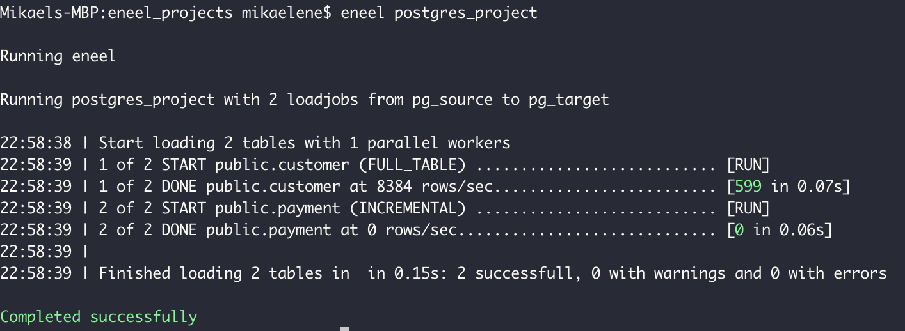

# eneel
eneel is a cli utility for extracting and loading data to and from relational databases. The E and L in ELT!

It uses and requires the database vendors cli utilities. I.e for Oracle it uses and requires 
[SQL*Plus](https://docs.oracle.com/cd/B19306_01/server.102/b14357/qstart.htm), 
for SQL Server [bcp](https://docs.microsoft.com/en-us/sql/tools/bcp-utility?view=sql-server-2017), 
for postgres it uses the postgres psql COPY command etc.

Features:
- Fastest way to extract and load large amounts of data between different databases
- Automatic table creation and conversion of datatypes
- Loads are executed in parallel 
- Incremental loads
- Omit "weird" datatypes on a project level. I.e omit all image datatypes in SQL Server or different blobs that selldom are used in a data warhouse environments
- Pretty runtime logging of load progress
- Limit rows load in development
- Configuration with yaml files. Just list the tables you want to replicate
- Configuration files approach makes versioning with git etc easier

## Installation
Make sure you have the cli-tools for your required databases then:
- With pip:

    pip install eneel

- Or clone the repository, go to the directory and:

    python setup.py install

## Configuration
After installation an example [connections.yml](connections.yml) file will be in your home directory (~/.eneel). That's where you configure your connection info to your sources and targets.

Next, create a [project configuration file](example_project.yml) in a directory for you EL projects.

## Running eneel
Go to the directory with the project configuration file and run eneel with the project file name excluding yml. I.e for a project configuration file as load_from_postgres_prod_to_dw.yml run:

    eneel load_from_postgres_prod_to_dw

The output will then be something like below for at successfull run:

## Feature matrix
Database | Source | Target
--- | :---: | :---: |
Postgres | YES | YES
Sql Server | YES | YES
Oracle | YES | NO

## Roadmap
- Support for [Snowflake](https://www.snowflake.com)
- Support for [BigQuery](https://cloud.google.com/bigquery/)
- Incremental loads with updates
- Incremental loads with deletes

## Reporting bugs and contributing code
- Go ahead and report an [issue](https://github.com/mikaelene/eneel/issues)
- Want to help? Pull requests are most welcome!